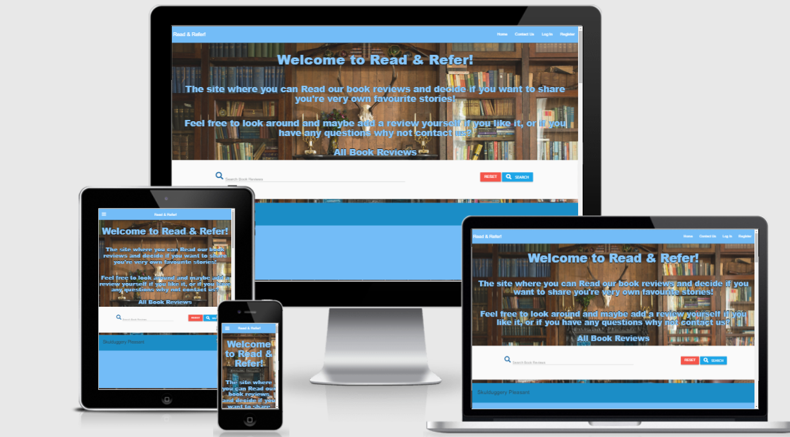

## Welcome 

This is the Readme for Read & Refer website!
 I hope to provide all the necessary information and and answer any questions you may have.
 I decided to take the approach of making the website first on normal broswer format as in a laptop or computer, 
 then styled and added what was needed for tablet and mobile devices.
 It is responsive on all devices, view the website here :

# User Experience (UX)
## User Stories
## First Time and Returning Users
### All users of this site will be looking for similar things in this project as outlined below:

- Navigate easy through all devices and have all areas of website responsive.
- To be able to view/preview the site before creating an account.
- Have clear Registration and Log In pages.
- To be able to view book reviews
- Have the ability to add their own reviews and keep a record of them.
- To be able to edit and delete reviews posted.
- For the review information to be clear and concise.
- To  be able to securely log out of the site.
- Find links to other sites and ares to purchase books.
- To be provided with contact information and social links.
- To store date securely 

## Design 

### Typograpghy

- For my typograpghy I used a Google font of Be Vietnam Pro with a fallback of sans serif.

### Imagery 

### Colour Scheme

- I used a colour scheme involving the materilize blue of "#64b5f6 blue lighten-2" along with white and different variations such as "#7bc1fa" and "#0381c0;" for when a anchor is hovered over.

## Wireframes

For the design of my wireframes I used Balsamic, You can find the link to the site here!   
I will also include screenshots below.

## Features
- Forms and contact section to allow users to give feedback.

- The site is responsive and can be viewed on all viewports.

- Store users data and allow them to create a account.

- Can add a book Review

- Add a Book Review

- Edit a book review 

- Delete a book review

- Register a Accout 

- view Profile 

- Flash messages to let user know if it has gone through or/and been created.

- site fully responsive on all viewporths and devices.

- Search bar to search for book reviews or reset page if book review is not found.

- Contact section to allow users to get in touch and email available.

- all links take the user to a new page and links are related the book review websites above the footer.

## Future features

- I would also like to include a questionare about peoples favourite books and sites

- Possibly add a game in the future to add even more interactivity.

- allow the admin to delete book reviews or modiy them more so.

## Technologies used

### languages used
- Javascript
- CSS
- HTML
- Markdown
- Python 
- Flask
- Pymongo

## Testing 

## To test my code I did it in the following way 

- I ran the code through the  different validators for each of my languages.

i. I would copy sections of code so as not to do a whole page and fix any problems within the section first.

ii. Paste the code into the correct tester.

iii. Once results and errors (if present) are visble, examine and correct the changes needed.
  
iv. Repeated the same process for all the languages.

- I would browse through the site on all the different types of view port to ensure it worked well.

i. I would browse through all of the site on the mobile and tablet viewports.

ii. I check all the links to make sure they worked correctly, I looked at the text content to make sure it came out the way intended.

iii. I would then make sure that all the correct text is visble and not too small, then I would interact with all the interactive elements to make sure they reacted correctly.

iv.  Open google tools and view any errors present.

v. Correct the changes if needed.

- I also viewed the site on different browsers to see how it reacted.

i. I would open up a diffrent browser be it be it mozilla,internet explorer or google.

ii. I would interact and click all the links available to make sure they worked.

iii. Interact with all interactive elements and code to make sure it ran they way its supposed to.

## Security Testing
All pages were tested to make sure that no unauthorised users can access pages they should not have access to.
If a user is logged out, they have no access to any pages they should not have access to.
All admin only pages can only be accessed by the admin.
Redirects are all working as expected, with correct flash messages present.

## Testing user stories 

- Navigate easy through all devices and have all areas of website responsive.

The site is fully responsive regardless of device used, and the navbar is clear and easy to navigate through on both mobile and desktop/laptop devices.

- To be able to view/preview the site before creating an account.

Users will have full access to the book reviews created before registering an account they may not edit or delete untill they have a account.

- Have clear Registration and Log In pages.

The registration and log in pages are clearly marked within the navbar, they are also linked on the home page, and are set as redirections for certain actions on the site if the user is not logged in.

- To be able to view book reviews

All viewers can view the book reviews regardless of having a account or not.

- Have the ability to add their own reviews and keep a record of them.

Once a user has registered an account, they will easily be able to add their own book reviews. The add book review link is in the navbar so is accessible from any page in the site.

- To be able to edit and delete reviews posted.

Once a book review has been submitted, the user who created the review will be able to edit and delete the review easily. There are buttons that link the user to these pages from the book review itself only if they have a account and they added the book review.

- For the review information to be clear and concise.

The review information is laid out clearly and users are shown very quickly what the site is about.

- To  be able to securely log out of the site.

There is a clear Log Out header which appears in the navbar for users who are logged in .

- Find links to other sites and ares to purchase books.

Under the book reviews on the base page there is links to other sites.

- To be provided with contact information and social links.

There is a contact form under the "Contact Us" link in the navbar.
We have also added a email in the footer if a user would like to contact that way.

- To store date securely 

The admin and user are both able to store their data which is sent to a mongo datebase, the passwords are salted to add more security and stop brute forcing.

## Bugs and problems

- After using the Google dev tools to help correct any mistakes in my code I  came across a error of "Failed to load resource: the server responded with a status of 404 (Not Found)" so i added a "link rel="shortcut icon" href="#" into the head of my html pages.

- materialize was not allowing my side nav components to be clicked on 

## Deployment
To deploy my Project to Github do it following these steps

1. Open up your Github and navigate to your repository.

2. Under the Repository section click settings.

3. Locate Git hub pages by scrolling down and underneath it click the drop-down menu to     select a folder for your publishing source.

4. Click save and locate the link under the same section and click into the site.

## Heroku
This project is deployed using Heroku. I done it in the following way 

- Within GitPod, create the .gitignore and env.py files.

- In the .gitignore file, set it to ignore the env.py file and pycache/ directory.

- Within the env.py file, set the following environmental variable:

- os.environ.setdefault(“IP”, “0.0.0.0”)
- os.environ.setdefault(“PORT”, “5000”)
- os.environ.setdefault(“SECRET_KEY”, “YOUR_SECRET_KEY”)
- os.environ.setdefault(“MONGO_URI”, “mongo db link to go here”)
- os.environ.setdefault(“MONGO_DBNAME”, “YOUR_DATABASE_NAME”)

- Make sure that the env.py file has been saved correctly and open the app.py file.

- Import OS, Flask and the env.py file.

- Create a requirements.txt file by typing in the terminal; pip3 freeze –local > requirements.txt.

- For Heroku, you will also need a Procfile. Create this by using the terminal and typing; echo web: python app.py > Procfile. 

- Access the Procfile and delete the bottom empty line to avoid any issues in the future.

- Go to the Heroku site, and log in or create a profile. From the dashboard, select “New App”.

-  Create a name for your app, select the correct region and click “Create App”.

- Navigate over to the “Deploy” tab and go to the “Deployment method” section. Click on GitHub.

- Search for your repository name, and click “Connect” next to your repository name.

- Next, go to the “Settings” tab, and scroll down to “Config Vars”. Click “Reveal config vars”.

- Enter the Key and Value pairs as per your env.py file;
IP : 0.0.0.0
PORT : 5000
SECRET_KEY : YOUR_SECRET_KEY
MONGO_URI : “mongo db link to go here”
MONGO_DBNAME : “your database name”

- Finally, go back to the “Deploy” tab, and scroll down to “Automatic deploys”. Click on “Enable Automatic Deploys” then “Deploy Branch”.
The app will now be built and upon completion, you will receive a message saying “Your app was successfully deployed”.

- You can now click on “Open App” which will launch the deployed app.

## Changes made after deployment

Site was deployed early from heroku before starting acctual code.

## Run code locally
To run my code locally follow these steps:
Log in to GitHub and locate the GitHub Repository

1. Under the repo name click Clone.

2. To clone a copy of the repo using HTTPS, copy the link under "Clone with HTTPS".

3. Using your IDE of choice open up your preferred terminal.

4. Navigate to your desired file location.

5. Copy the link and input it into your terminal to clone my project.

6.  You are Done!

7. You can get more of this information in more detail here: (https://docs.github.com/en/github/creating-cloning-and-archiving-repositories/cloning-a-repository)

## Credit

First I would like to thank my mentor Samantha for all the help and then the Code Institute! I have added links to all the relevant sites I adapted code from or used to aid in me the making of this site.

## Materialize

https://materializecss.com/navbar.html

- used for navbar and footer also uses there styles for my blue colour uses throughout
## Code institute 

- adapted and project inspired from mini project "putting it all together"

## W3C SCHOOLS

https://www.w3schools.com/default.asp

- used for inspiration on many aspects, adapted contact form from there site 

## JSHINT

https://jshint.com/

- Used to correct JS

## JIGSAW

https://jigsaw.w3.org/css-validator/

- Used to correct CSS.

## JQuery

- Used for materialize code.

## Google fonts

https://fonts.google.com/specimen/Be+Vietnam+Pro

- Used for my Be Vietnam font.

## Google images 

https://www.google.com/search?q=red+armchair+library+fireplace+photo&tbm=isch&bih=722&biw=1536&rlz=1C1VDKB_enIE944IE944&hl=en&sa=X&ved=2ahUKEwignca4ioTzAhU-SBUIHb5UDBwQBXoECAEQMA#imgrc=rElmGpzLGWNO-M

- For background photo

## FONT AWESOME

https://fontawesome.com/v5.15/icons?d=gallery&p=2

- used for Icons for socials in footer.

## WIKIPEDIA

https://en.wikipedia.org/wiki/Main_Page

- Used for info on books

## HTML validator 
 
 https://validator.w3.org/nu/#textarea

 - Used to correct code

## CSS TRICKS
- Used for inspiration on my whole site along with W3C Schools.

## W3C CSS validator 

https://jigsaw.w3.org/css-validator/validator

- Used to correct code

## Am I responsive

http://ami.responsivedesign.is/#

- used for mock up

